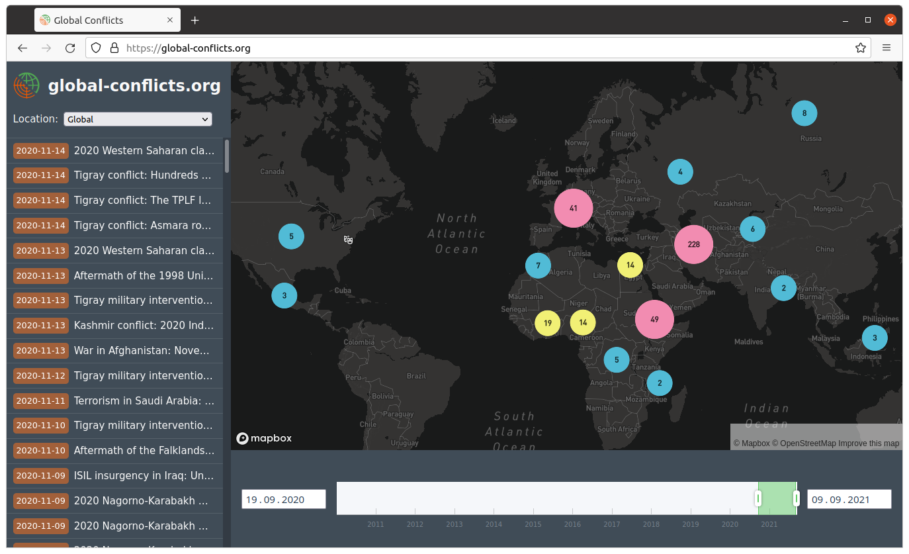

# Visualization of armed conflicts from Wikipedia

> A web application for the Bachelor's thesis on »Geospatial visualization of Wikipedia news reports about armed conflicts«


<p align="center">
   
</p>

## 1. Demo

Visit the demo website at: [global-conflicts.org](https://global-conflicts.org)

## 2. Setup

### 2.1 Frontend

Install npm and run:

```sh
cd frontend/
```

```sh
npm run dev
```

After that, the server is available under [localhost:3000](http://localhost:3000).

### 2.2 Data processing pipeline


