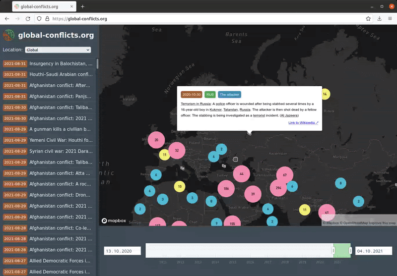

# Visualization of armed conflicts from Wikipedia

> A web application for the bachelor's thesis on »Geospatial visualization of Wikipedia news reports about armed conflicts«


<p align="center">
   
</p>

## 1. Demo

Visit the demo website at: [global-conflicts.github.io](https://global-conflicts.github.io/)

## 2. Setup

### 2.1 Frontend

Install npm and run:

```sh
cd frontend/
```

```sh
npm run dev
```

After that, the server is available under [localhost:3000](http://localhost:3000).

### 2.2 Data processing pipeline

The output of individual pipeline modules can be found in the the `data/` folder.

If you want to compile the dataset on your own, install Python and run:


```sh
cd tools/
```

```sh
pip install -r requirements.txt
```

Next, this command scrapes data from Wikipedia and Wikidata and stores plain text files in a given folder:

```sh
python3 scraper.py 2010-01-01 2021-08-31 | python3 parser.py | python3 extractor.py "Armed attacks and conflicts" "Armed conflicts and attacks" | python3 locator.py | python3 exporter.py -o ../data/10years_export/ > ../data/10years.exporter.txt
```

> Note: This will take a longer time

Afterwards, upload the content of the `10years_export/` folder to the TextImager remote server and start a new job:

```sh
curl -k -X POST "https://textimager.hucompute.org/rest/big-data/analyse?url=%2Fresources%2Fcorpora%2FStudents%2Fba_bausch%2Ftest_in&language=en&inputFormat=TXT&nodepool=default&fileSuffix=txt&sortBySize=false&pipeline=OpenIEParser&process_memory_size=30&process_deployments_max=2&process_per_item_time_max=24000&outputFormat=XMI&outputLocation=%2Fresources%2Fcorpora%2FStudents%2Fba_bausch%2Ftest_out&outputCompression=GZIP&description=Wikipedia%20Tickermeldungen&modificationUser=s3398921&modificationComment=textimager" -H  "accept: application/json"
```

> Note: Adjust the parameters to your directory and username

Lastly, download the resulting files from the TextImager server to the `10years_import/` directory and run:

```sh
python3 importer.py -i ../test/in/ | python3 quantifier.py | python3 jsonifier.py ../frontend/src/data/incidents.json
```

The dataset can now be used by the frontend.
